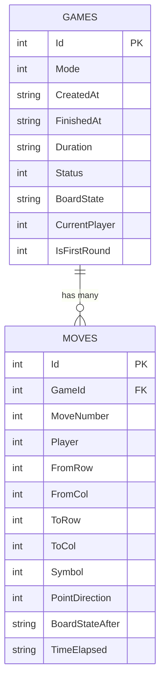

# Database Schema ( 2 tables )

```mermaid
erDiagram
    GAMES {
        int Id PK
        int Mode
        string CreatedAt
        string FinishedAt
        string Duration
        int Status
        string BoardState
        int CurrentPlayer
        int IsFirstRound
    }

    MOVES {
        int Id PK
        int GameId FK
        int MoveNumber
        int Player
        int FromRow
        int FromCol
        int ToRow
        int ToCol
        int Symbol
        int PointDirection
        string BoardStateAfter
        string TimeElapsed
    }

    GAMES ||--o{ MOVES : "has many"
```